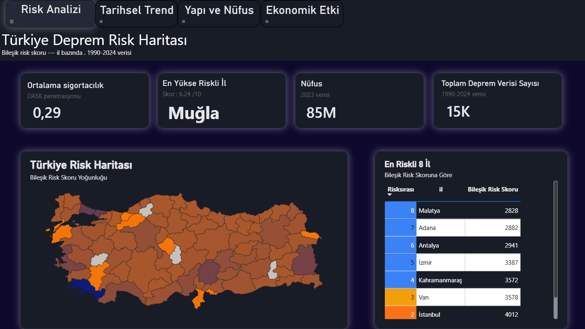
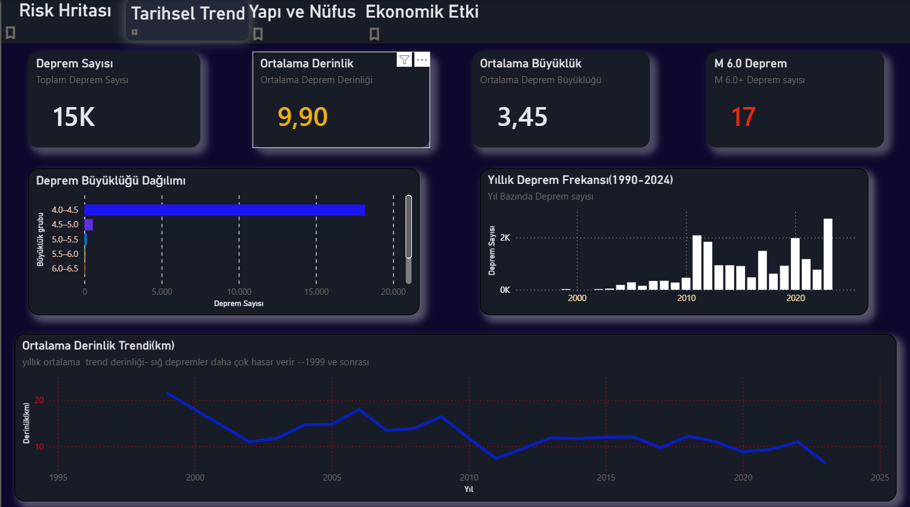
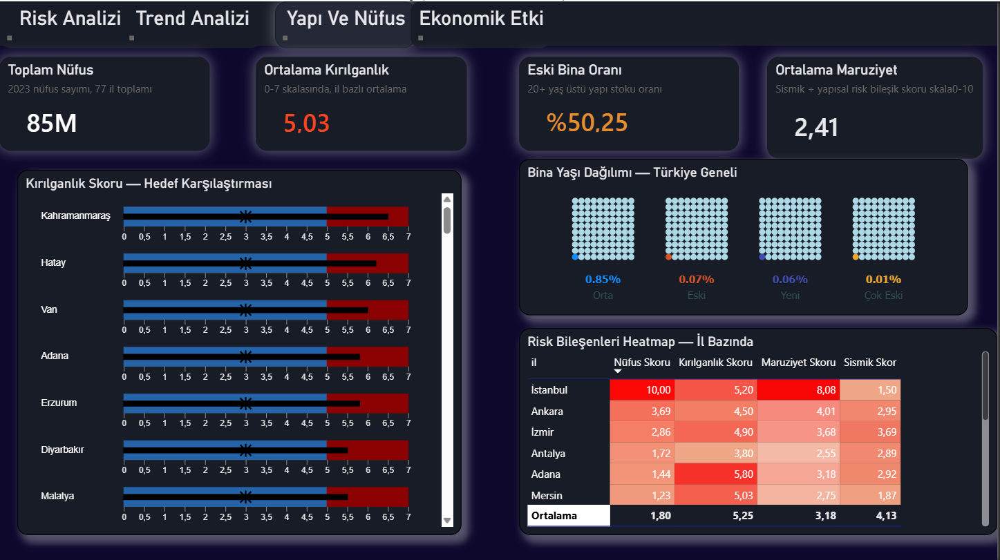
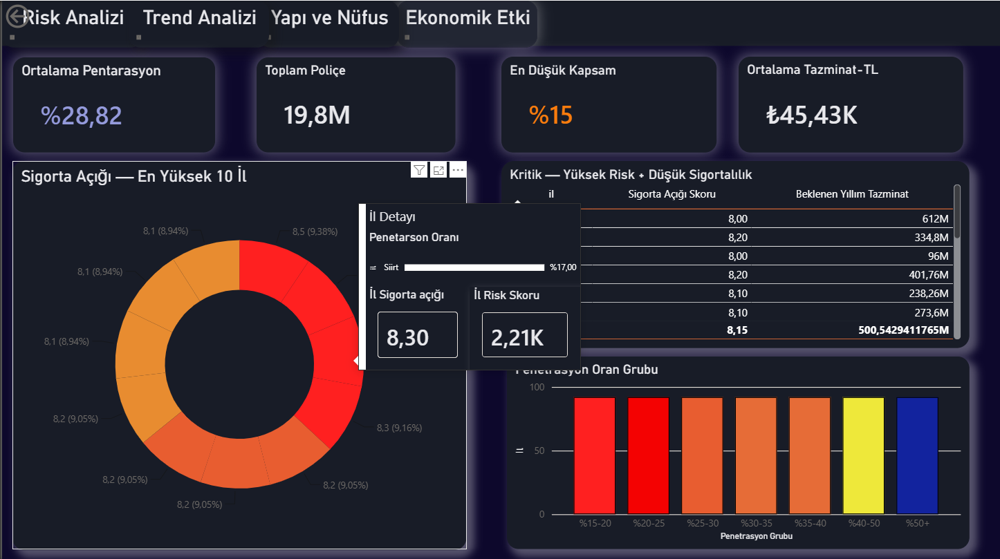

# Türkiye Deprem Risk Modeli (Power BI)

AFAD/USGS deprem verisi, TÜİK nüfus-bina istatistikleri ve DASK sigortacılık verisini il bazında birleştirip her ilin deprem riskini çok bileşenli bir skorla gösteren analiz projesi. Veri toplama ve skorlama Python ile yapılıyor, sonuçlar Power BI dashboard'unda görselleştiriliyor.

## Ekip

- Proje Yürütücüsü: Beyza Nur DİNÇER — KTÜ YBS (Python, Power BI)
- Proje Ortağı: Elif ÇAKIR — Marmara Aktüerya (R, modelleme)

## 📁 Repo yapısı

```
deprem-risk-model/
├── README.md
├── LICENSE
├── requirements.txt
├── .gitignore
├── src/
│   ├── pipeline/
│   │   ├── afad_fetch.py       # AFAD/USGS deprem verisi çekme + birleştirme
│   │   ├── spatial_join.py     # deprem noktalarını il sınırlarına eşleştirme + sismik skor
│   │   ├── tuik_fetch.py       # nüfus + bina stoku → maruziyet skoru
│   │   ├── dask_fetch.py       # DASK sigortacılık verisi → sigorta açığı skoru
│   │   └── eda.py              # keşifsel veri analizi (büyüklük/derinlik/yıllık frekans grafikleri)
│   └── analysis/                # R aktüeryal modelleme scriptleri için ayrılmış (şu an boş)
├── data/
│   ├── raw/                    # ham/yarı-ham veri (AFAD, USGS, TÜİK, DASK)
│   ├── processed/               # il bazlı skor tabloları + grafikler (.png)
│   └── external/                # GADM il sınırı shapefile (script tarafından indirilir)
├── powerbi/
│   └── pbix/
│       └── deprem_risk_analizi.pbix
├── notebooks/                    # keşif defterleri için ayrılmış (şu an boş)
└── docs/
    ├── screenshots/               # sayfa görselleri (PNG)
    └── references/                # kaynak notları / fizibilite raporu için ayrılmış (şu an boş)
```

## 🗂️ Veri kaynakları ve çıktılar

| Script | Kaynak | Yöntem | Ana çıktı |
|---|---|---|---|
| `afad_fetch.py` | AFAD API, yedek olarak USGS API | 1990–2024, M≥4.0 depremleri çeker, iki kaynağı birleştirir, temel kalite kontrolü yapar (derinlik/büyüklük aykırı değer uyarısı) | `data/raw/depremler_birlesik.csv` |
| `spatial_join.py` | GADM Türkiye il sınırı shapefile + yukarıdaki deprem verisi | Her deprem noktasını `geopandas.sjoin` ile bir ile atar (sınır dışı kalanlar `sjoin_nearest` ile en yakın ile atanır), il bazında sismik istatistik ve **sismik skor** hesaplar | `data/processed/il_sismik_istatistik.csv`, risk haritası (`07_turkiye_risk_haritasi.png`) |
| `tuik_fetch.py` | TÜİK ADNKS 2023 nüfus verisi + bina stoku/yaşı verisi (kod içinde manuel tanımlı — bkz. Bilinen kısıtlar) | Nüfus ve kırılganlığı birleştirip **maruziyet skoru** hesaplar | `data/processed/maruziyet_skoru.csv` |
| `dask_fetch.py` | DASK 2023 Faaliyet Raporu (kod içinde manuel tanımlı — bkz. Bilinen kısıtlar) | Penetrasyon oranından **sigorta açığı skoru** ve beklenen yıllık tazminatı hesaplar | `data/processed/dask_sigortacilik.csv` |
| `eda.py` | Birleşik deprem verisi | Büyüklük dağılımı, yıllık frekans (1999 ve 2023 vurgulu), derinlik dağılımı, M6.0+ deprem haritası | `data/processed/0*.png`, `buyuk_depremler_m6plus.csv` |

## 🧮 Skorlama formülleri

Aşağıdaki üç bileşen skoru doğrudan Python koduna yazılmış, 0–10 arası normalize edilmiş değerler:

```
sismik_skor        = (deprem_sayisi / max(deprem_sayisi)) * 5
                    + (max_buyukluk  / max(max_buyukluk))  * 3
                    + (m5_ustu       / max(m5_ustu))       * 2

maruziyet_skoru     = nufus_skoru * 0.6 + kirilganlik_skoru * 0.4
  nufus_skoru       = nufus_2023 / max(nufus_2023) * 10
  kirilganlik_skoru = eski_bina_orani * 10

sigorta_acigi_skoru = (1 - penetrasyon_oran) * 10
```

Dashboard'daki **"Bileşik Risk Skoru"** (Risk Analizi sayfasındaki "En Riskli 8 İl" tablosu) bu üç bileşenin Power BI tarafında DAX ile birleştirilmesiyle hesaplanıyor. Bu ağırlıklandırma formülü Python pipeline'ında yer almıyor — `.pbix` dosyasının Model/DAX görünümünden doğrulanması gerekiyor. R tarafındaki aktüeryal modelleme (`src/analysis/`) henüz bu repoya eklenmedi.

## 📊 Sayfalar

**Risk Analizi** — Ortalama sigortacılık, En Yüksek Riskli İl, Nüfus ve Toplam Deprem Verisi Sayısı KPI kartları; il bazında bileşik risk skoru yoğunluk haritası; en riskli 8 ilin tablosu



**Tarihsel Trend** — Deprem Sayısı, Ortalama Derinlik, Ortalama Büyüklük ve M6.0+ Deprem Sayısı KPI kartları; deprem büyüklüğü dağılımı, yıllık deprem frekansı (1990–2024) ve ortalama derinlik trendi grafikleri



**Yapı ve Nüfus** — Toplam Nüfus, Ortalama Kırılganlık, Eski Bina Oranı ve Ortalama Maruziyet KPI kartları; il bazında kırılganlık skoru–hedef karşılaştırması, Türkiye geneli bina yaşı dağılımı, il bazında risk bileşenleri heatmap tablosu



**Ekonomik Etki** — Ortalama Penetrasyon, Toplam Poliçe, En Düşük Kapsam ve Ortalama Tazminat KPI kartları; en yüksek sigorta açığına sahip 10 il donut grafiği, yüksek risk + düşük sigortalılık kesişimindeki iller tablosu, penetrasyon oran gruplarına göre dağılım



## ⚠️ Bilinen kısıtlar

- **TÜİK ve DASK verileri manuel tanımlı.** `tuik_fetch.py`'nin kendi yorumunda belirttiği gibi TÜİK'in açık API'sine doğrudan erişim kısıtlı olduğu için nüfus ve bina stoku verisi kod içine il bazında elle girilmiş; aynı şekilde DASK sigortacılık verisi de canlı bir API'den değil, DASK 2023 Faaliyet Raporu'ndan elle girilmiş yaklaşık değerlerden geliyor.
- **Bina stoku sadece ~20 il için gerçek veri içeriyor** (`bina_stoku_manuel()` fonksiyonu), geri kalan iller için eksik değerler ülke ortalamasıyla dolduruluyor (`fillna`) — bu illerin kırılganlık skoru gerçek yerel veriyi değil, ülke ortalamasını yansıtıyor.
- **`data/processed/` içinde iki farklı sismik istatistik dosyası var** — `il_sismik_istatistik.csv` ve `il_sismik_istatistik_v2.csv` — ve sonuçları örtüşmüyor (ör. v1'de en yüksek skor Muğla/9.54, v2'de Van/8.96). Hangisinin Power BI modelinde kaynak olarak kullanıldığı net değil; tek bir güncel dosyaya indirilmesi öneriliyor.
- **v2 tablosunda "Akdeniz" adında bir il satırı var** — bu geçerli bir il adı değil, muhtemelen `spatial_join.py`'daki sınır-dışı nokta eşleştirmesinden (`sjoin_nearest`) kaynaklanan bir hata; temizlenmesi gerekiyor.
- Sayfa sekmelerinden birinde küçük bir yazım hatası var: "Risk Hritası" → "Risk Haritası" olmalı.
- Deprem verisi M≥4.0 ile sınırlı; küçük depremler ve öncü/artçı şok yoğunluğu bu veri setinde görünmüyor.
- `spatial_join.py` çalıştırılırken Türkiye il sınırı shapefile'ı harici bir kaynaktan (GADM) indiriliyor; internet bağlantısı gerektiriyor ve kaynak URL zamanla değişebilir.
- R tarafındaki aktüeryal modelleme (`src/analysis/`) şu an repoda yer almıyor; ekip ortağının çalışması henüz eklenmemiş.
- Repo'da `main`'e henüz birleştirilmemiş `feature/actuarial-model` adında aktif bir branch var.

## 🚀 Kurulum adımları

1. `pip install -r requirements.txt`
2. `python src/pipeline/afad_fetch.py` — deprem verisini çeker ve birleştirir.
3. `python src/pipeline/spatial_join.py` — depremleri illere eşleştirir, sismik skoru ve risk haritasını üretir.
4. `python src/pipeline/tuik_fetch.py` — nüfus + bina verisinden maruziyet skorunu üretir.
5. `python src/pipeline/dask_fetch.py` — DASK verisinden sigorta açığı skorunu üretir.
6. `python src/pipeline/eda.py` — isteğe bağlı, keşifsel analiz grafiklerini üretir.
7. Power BI Desktop ile `powerbi/pbix/deprem_risk_analizi.pbix` dosyasını açın; veri kaynağı yolları değiştiyse **Transform Data → Data source settings** üzerinden `data/processed/` altındaki CSV'lere yeniden bağlayın.
8. Sayfaları inceleyin: Risk Analizi, Tarihsel Trend, Yapı ve Nüfus, Ekonomik Etki.

## Nasıl Açılır

`.pbix` dosyasını indirip Power BI Desktop ile açman yeterli.

## Lisans

MIT — bkz. [`LICENSE`](LICENSE).
